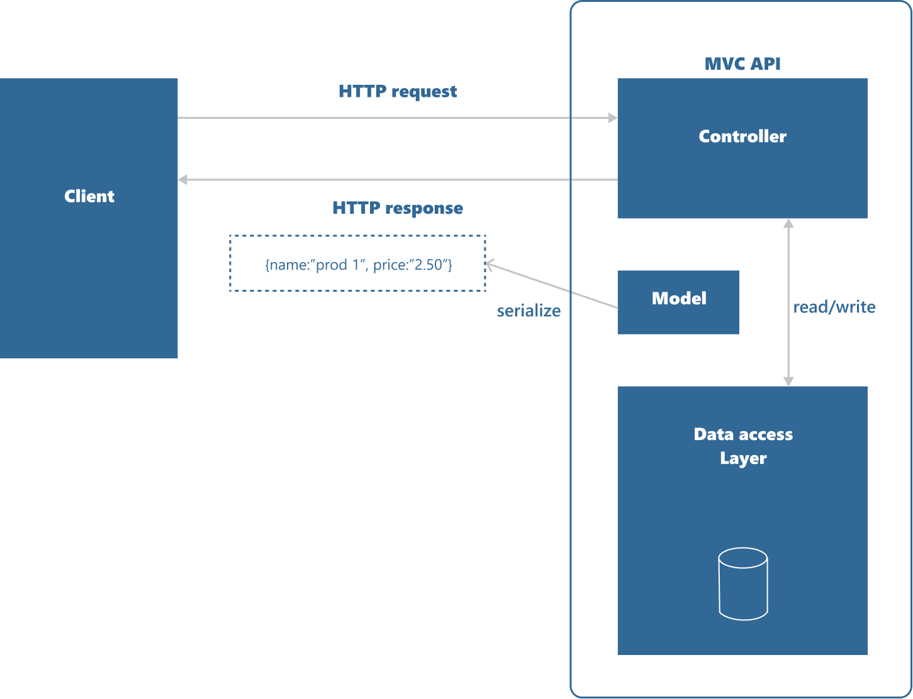
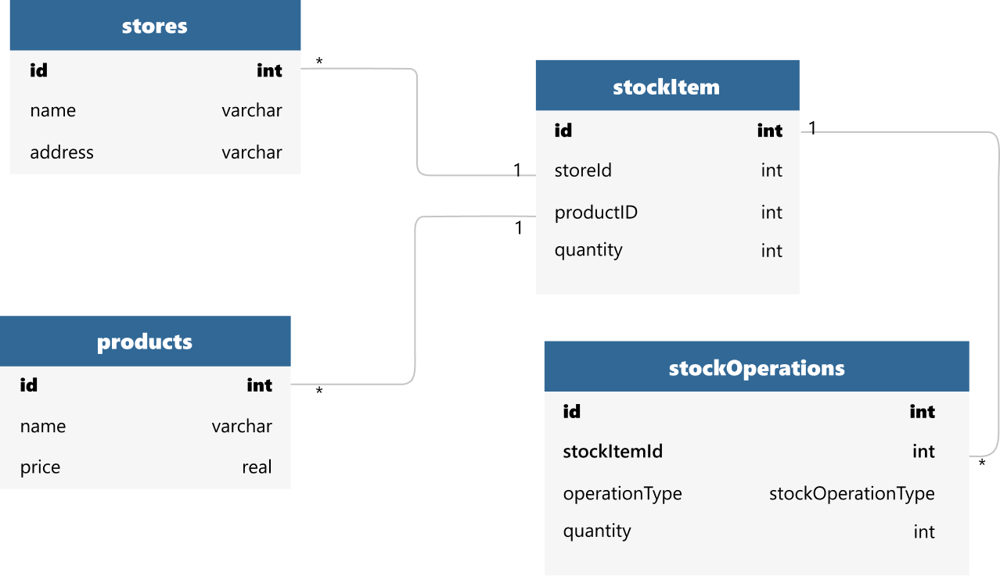
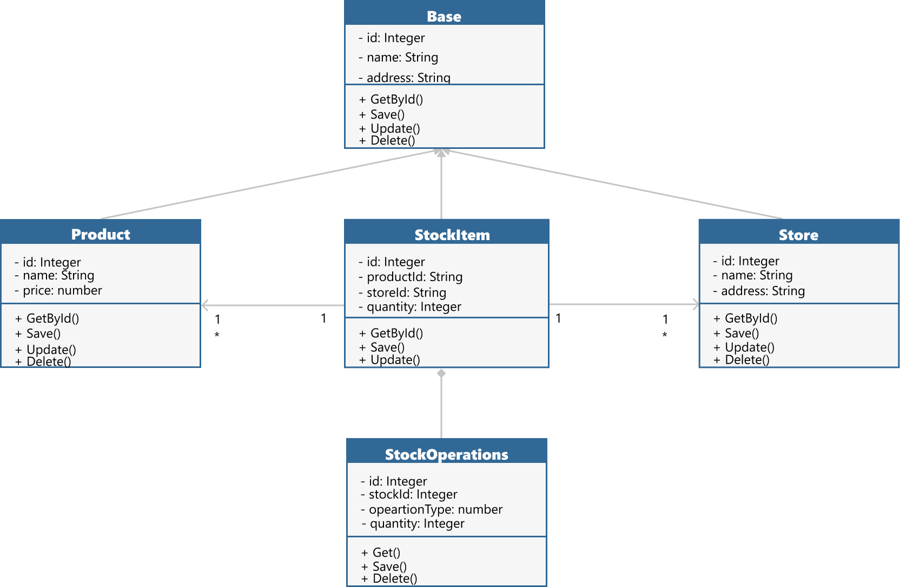

# Virtual Store
[](https://www.codacy.com/gh/Lawniet/virtualstoreapi/dashboard?utm_source=github.com&amp;utm_medium=referral&amp;utm_content=Lawniet/virtualstoreapi&amp;utm_campaign=Badge_Grade)
[](https://github.com/Lawniet/virtualstoreapi/blob/master/LICENSE)

## Description
Virtual Store Management for users (after authentication,) can register, change, delete or search for Stores, Products and stocks.

## :link: Design:

### API


### SQL


### Class


[https://www.figma.com/file/K7eJzfgKeFc0UM85l2DO9C/System's-Design%3A-Virtual-store?node-id=2%3A2](See more in Figma)

## :rocket: Technologies and Principles:

- ✔️  .NET >= 5.0;
- ✔️  In-Memory DB;
- ✔️  MVC;
- ✔️  SOLID;
- ✔️  Clean Code;
- ✔️  Inheritance and Polymorphism;
- ✔️  Entity Framework;
- ✔️  DTOs.

## :information_source: Installation

### Pre Requisites

Before starting the project, you will need the following tools : 

    - [ ] [VsCode](https://code.visualstudio.com/download);
    - [ ] [Git](https://git-scm.com/)
    - [ ] [SDK](https://dotnet.microsoft.com/en-us/download/dotnet/5.0)
    - [ ] [Nuget](https://www.nuget.org/downloads)

### Execution
```bash
1. Clone the project in Visual Studio using this repository: $ git clone https://github.com/Lawniet/VirtualStoreApi.git
2. Run the project in debug mode with IIS Express
3. The application's Swagger will open
4. API is protected by JWT token. The only endpoint released is the JWT. Run it and copy the generated token
5. Click the authentication button (a padlock at the top of the swagger page).
6. In the required field, write Bearer + generated token. This will allow access to the endpoints.
```
<br>

## :seedling: Developer: 
Lauany Reis da Silva
- LinkedIn: [https://www.linkedin.com/in/lauany-reis-da-silva/](https://www.linkedin.com/in/lauany-reis-da-silva/)
- Github: [https://github.com/Lawniet](https://github.com/Lawniet)
